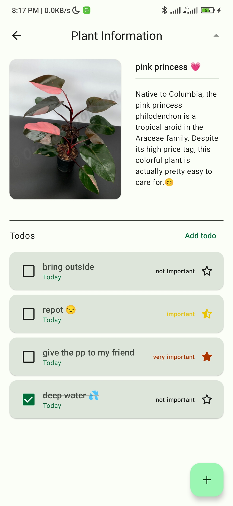
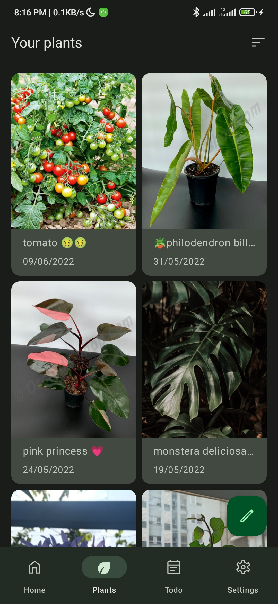
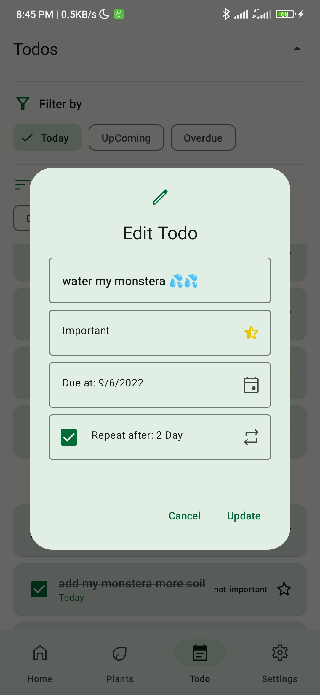
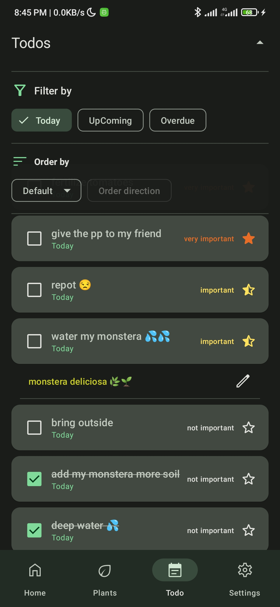

# Plant Care
**This is a students's project from [UIT - University of Information Technology](https://www.uit.edu.vn/)**.

## Android development
Plant Care uses many of libraries and tools:
- Entirely written in [Kotlin](https://kotlinlang.org/).
- UI completely written in [Jetpack Compose](https://developer.android.com/jetpack/compose).
- Uses [Kotlin Coroutines](https://kotlinlang.org/docs/coroutines-guide.html) throughout.
- Uses many of the [Architecture Components](https://developer.android.com/topic/architecture), including: Lifecycle, Navigation, DataStore ...
- Uses [Hilt](https://dagger.dev/hilt/) for dependencies injection.
- [Firebase](https://firebase.google.com/?gclsrc=ds&gclsrc=ds&gclid=CLSM9rmjnfgCFZE0jgodz_IC2g) is used for mangaging users ([Firebase Authentication](https://firebase.google.com/products/auth?gclsrc=ds&gclsrc=ds&gclid=CIKj-K-gnfgCFU3FhAAdifoKfg)), storing data ([Cloud Firestore](https://firebase.google.com/products/firestore?gclsrc=ds&gclsrc=ds&gclid=CKu32MSgnfgCFQTEhAAdXRsOqQ), [Cloud Storage](https://firebase.google.com/products/storage?gclsrc=ds&gclsrc=ds&gclid=CMnp6M2gnfgCFUbpjgodhFgADw)).
- The UI design is inspried by [Material Design 3](https://m3.material.io/) and implemented with [Compose Material 3](https://developer.android.com/reference/kotlin/androidx/compose/material3/package-summary).
- Uses [Coil](https://github.com/coil-kt/coil) as image loader.
- Includes libraries from [Google Accompanist](https://google.github.io/accompanist/): Pager layouts, Swipe Refresh, Navigation Animation ...

## Application achitechture
Using [MVVM](https://developer.android.com/topic/architecture?gclsrc=ds) with [Clean Architecture](https://blog.cleancoder.com/uncle-bob/2012/08/13/the-clean-architecture.html) brings us lots of benefits:
- The code is further decoupled (the biggest advantage.)
- The code is even more easily testable than with plain MVVM.
- The package structure is easier to navigate.
- The project is even easier to maintain.

The data flow will look like this:

## Main features
Two main features of the application are:
- Create a collection of plants with name, description (optional) and a picture of that plant.

Todo             |  Todo list
:-------------------------:|:-------------------------:
  |  

- Manage the todos (tasks) related to a plant.

Plant             |  Plant list
:-------------------------:|:-------------------------:
  |  

Other features are:
- Sign in (with email & password or with Google account), sign up, sign out, reset password.
- Change app theme (light, dark or auto-using system theme).

Features in development:
- Sign in with Facebook and Twitter, change language  (currently support English only) and more ...

## App screens
  

https://user-images.githubusercontent.com/87962065/172855315-7e313fc3-133e-449b-ba36-c1f517c8bfb4.mp4

https://user-images.githubusercontent.com/87962065/172855405-73a44508-0e83-483a-bac2-b5af3d11e1a2.mp4

